🛒 NextLevel PC - Full Stack Project

Aplicación full stack de e-commerce orientada a hardware y videojuegos, con autenticación de usuarios, carrito dinámico, panel administrativo y API REST.

🚀 Tecnologías
- Node.js
- Express
- MySQL
- Sequelize
- React (dashboard administrativo)

🛠 Instalación

# Backend

npm install
nodemon app.js

# Frontend (React Dashboard)

cd dashboard
npm install
npm start

📦 Funcionalidades
- Registro y login de usuarios
- CRUD de productos
- Carrito dinámico sin recarga de página
- Sistema de checkout
- Productos físicos y digitales
- Control de stock en tiempo real
- Galería de imágenes interactiva
- Roles y permisos
- API REST (/api/products - /api/users)
- Dashboard en React consumiendo la API

📊 Dashboard
Panel administrativo con:
- Total de productos
- Total de usuarios
- Categorías
- Último producto
- Listado de productos

## Variables de entorno

Crear un archivo `.env` con:

```env
DB_NAME=
DB_USER=
DB_PASSWORD=
SESSION_SECRET=
```

🔐 Roles de usuario
- Admin: gestión de productos y acceso al dashboard
- Usuario: navegación, carrito y compra

🔗 Endpoints
- http://localhost:3002/api/products
- http://localhost:3002/api/users

## 🗂️ Estructura del proyecto

```txt
├── controllers/     # Lógica de cada ruta
├── middlewares/     # Autenticación y validaciones
├── routes/          # Definición de rutas Express
├── views/           # Plantillas EJS
├── public/          # CSS, JS e imágenes
├── database/        # Modelos Sequelize y configuración
├── helpers/         # Funciones reutilizables del carrito
├── app.js           # Entry point
└── package.json
```

📸 Capturas del proyecto
- Home
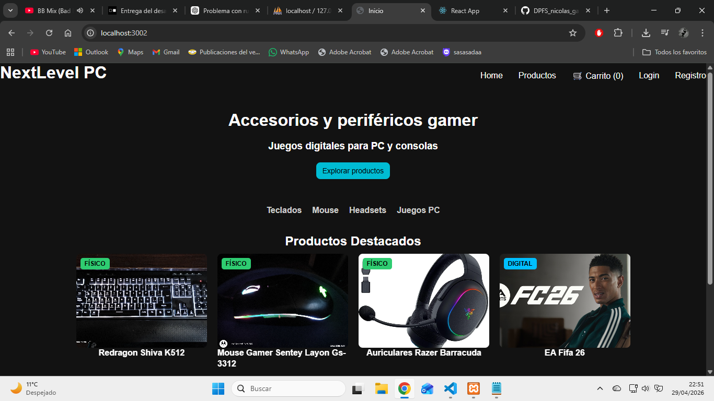

- Listado de productos
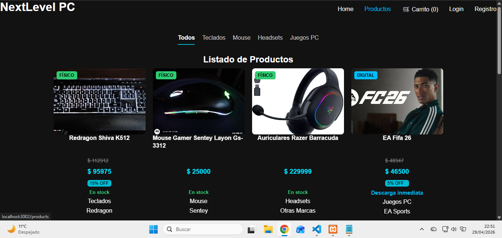
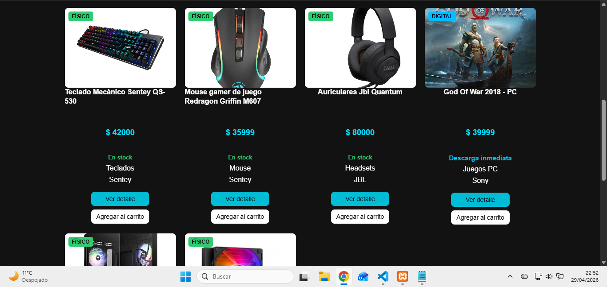

- Detalle de producto
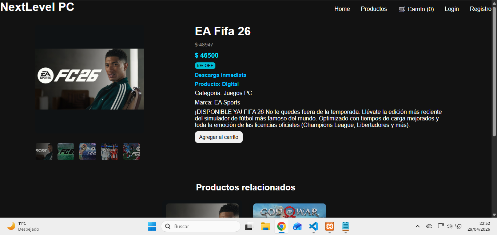

- Carrito
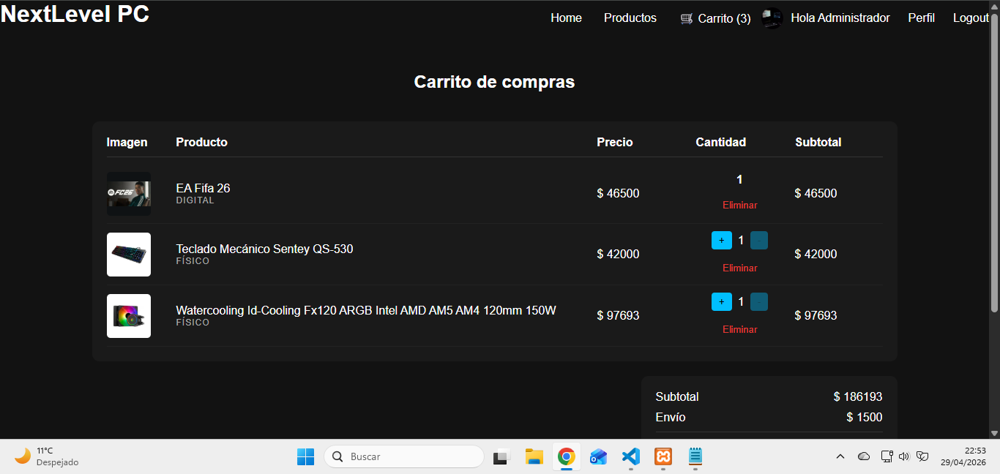
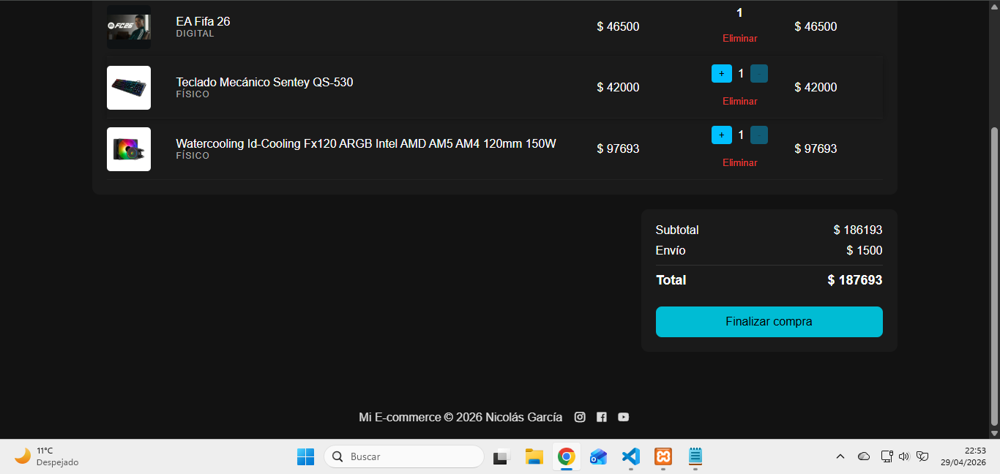

- Inicio de sesión
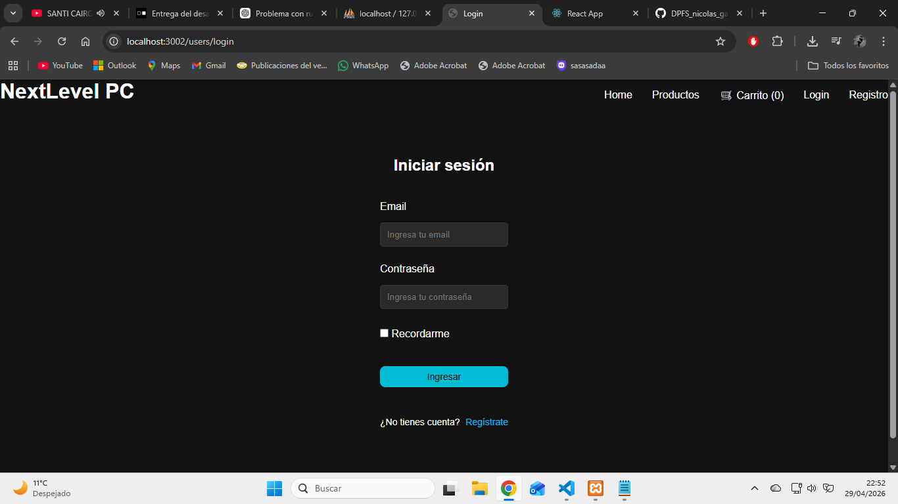

- Registro
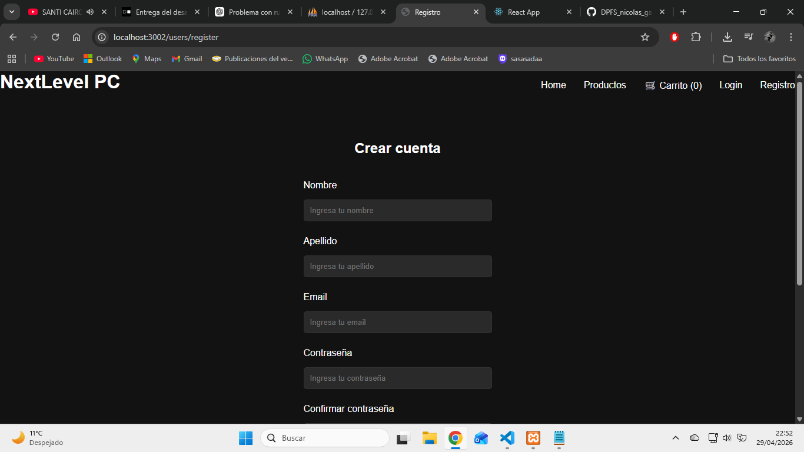
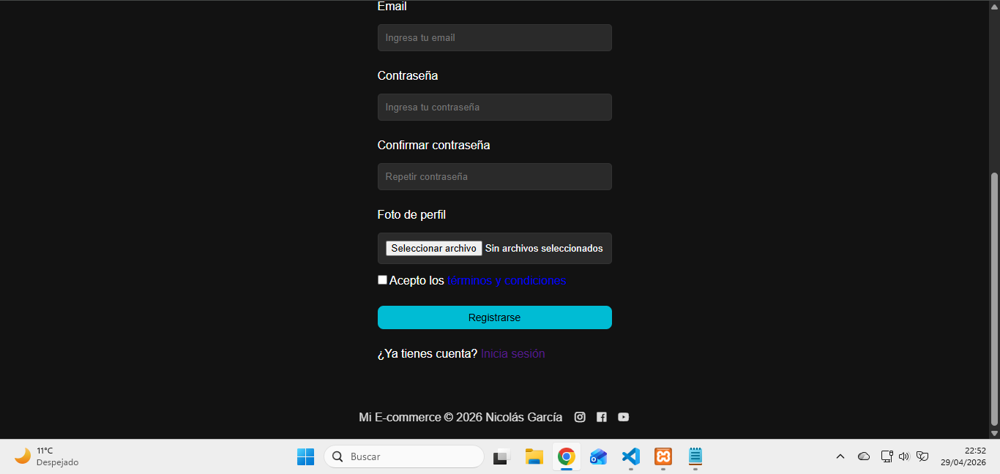

- Dashboard
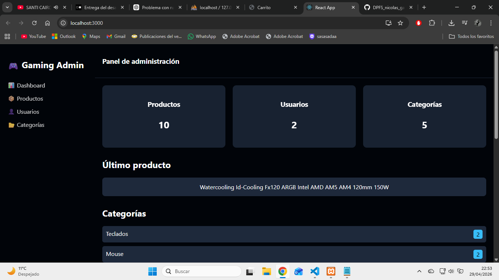
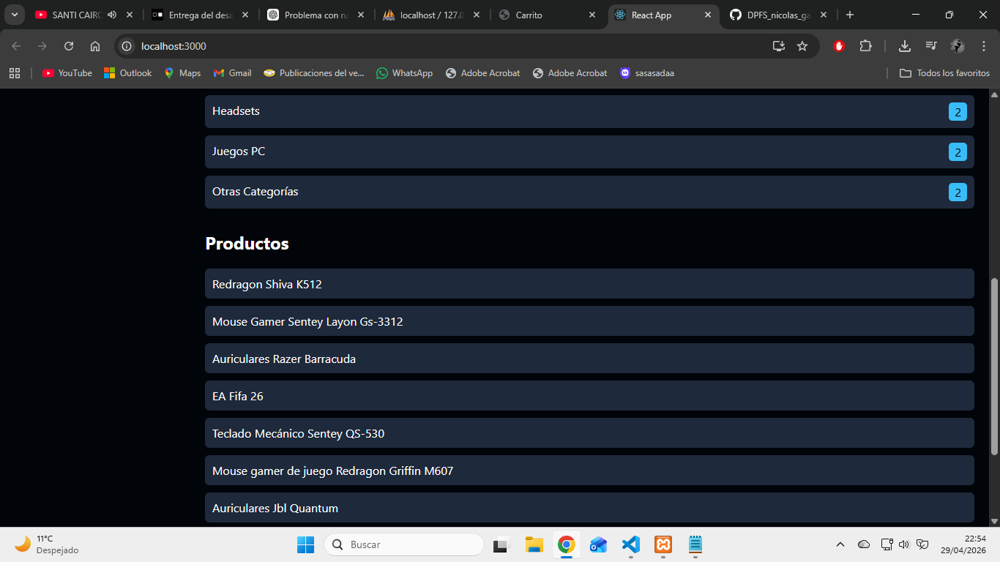

## Base de datos

1. Abrir phpMyAdmin
2. Crear base de datos: gaming_store
3. Importar archivo:
   /db/gaming_store.sql

## 📚 Referencias

Documentación oficial utilizada durante el desarrollo:

- [Express.js](https://expressjs.com/)
- [Node.js](https://nodejs.org/)
- [MySQL 8.0](https://dev.mysql.com/doc/)
- [React](https://react.dev/)
- [Sequelize ORM](https://sequelize.org/)

## 🚀 Próximas mejoras

- Deploy público del proyecto
- Base de datos remota
- Persistencia de imágenes en la nube
- Mejoras de UX y rendimiento

## 👨‍💻 Autor
Nicolas Garcia
🔗 GitHub: [Nicolas-1990](https://github.com/Nicolas-1990)
📧 Email: nicolas_garcia1990@hotmail.com